# PROJECT Design Documentation

> _The following template provides the headings for your Design
> Documentation.  As you edit each section make sure you remove these
> commentary 'blockquotes'; the lines that start with a > character
> and appear in the generated PDF in italics._

## Team Information
* Team name: Better Monkeys
* Team members
  * Lucie Lim
  * Dara Prak
  * Jaden Seaton
  * Robert Huang
  * Adam Pang

## Executive Summary

A snack e-store where users can browse, purchase, and rate snacks. 
They can also view their purchase history just in case they loved
a snack but dont remember the name.

### Purpose
The purpose behind the project is to learn about the development 
process of a website from scratch. In this case we learned the 
basics for a e-store website with functions for the owner and 
customers, such as adding new products, changing info of the 
product, browsing products, and updating customers shopping 
cart.

### Glossary and Acronyms
> _Provide a table of terms and acronyms._

| Term | Definition |
|------|------------|
| SPA | Single Page |

## Requirements

This section describes the features of the application.

User authentication: Depending on username and password the 
user will have certain responsibilities, and features they 
are able to access. The owner will be able to add, remove 
and change info of a product. Customers will see their 
subscription, reviews, and browse snacks.

Shopping cart: Users will be able to add and remove 
stuff from their cart, and update it to their satisfaction.

Rating System: Users will be able to create a review 
of a snack that would show others how good a snack is 
worth buying. They are able to see the average rating 
of a snack along with individual ratings of others. 

Order History: users will be able to see their order 
history for every snack purchase they made. They can
see the date, time and what snacks they bought.

### Definition of MVP
A system where a user can make a snack, search for a 
specific snack, search for snacks given a word of the
snack, delete a snack, get all snacks, and update 
details of a snack.

### MVP Features
- Delete a single snack
- Update a single snack
- Create a new snack
- Get entire inventory
- Search for a snack
- Get a single snack

### Roadmap of Enhancements
- Order history
- Ratings & reviews for snacks

## Application Domain

This section describes the application domain.

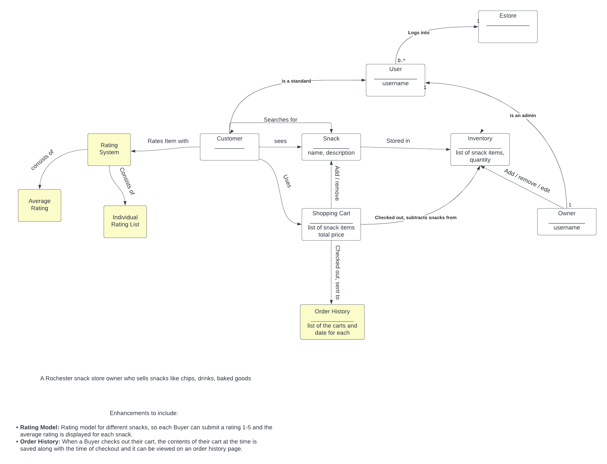

This is a domain model of our snack e-store, it shows the relations
between the user, and the features of our website such as the 
shopping cart, where the customer can add and remove items from 
the cart. The model also displays the relationship between the 
owner and the inventory, adding, removing, and updating snacks.
Also it shows new features such as the subscription where the
customer can edit a subscription and change how frequently 
they can recieve snacks.

## Architecture and Design

This section describes the application architecture.

### Summary

The following Tiers/Layers model shows a high-level view of the webapp's architecture.

The e-store web application, is built using the Model–View–ViewModel (MVVM) architecture pattern. 

The Model stores the application data objects including any functionality to provide persistance. 

The View is the client-side SPA built with Angular utilizing HTML, CSS and TypeScript. The ViewModel provides RESTful APIs to the client (View) as well as any logic required to manipulate the data objects from the Model.

Both the ViewModel and Model are built using Java and Spring Framework. Details of the components within these tiers are supplied below.

### Overview of User Interface

This section describes the web interface flow; this is how the user views and interacts
with the e-store application.

When a user first encounters our website they are presented with the homepage and 
a navigation bar with 4 buttons: Home, Catalog, Shopping cart and Login. Initially
the user is given the homepage to view. They are greeted with messages enticing them 
to shop and some snacks to browse. If they want to see more they can click on the 
catalog button and they are sent to a page where all the snacks are present, they 
can click on a snack and view the details of a snack as well. They can click on 
the shooping cart link in the nav bar however it will tell them to login first to 
access it. 

The login link will show 2 options one is for current buyers of the store
to login and a register button so that new users can sign up. Once a user signs up 
they now have access to the shopping cart and can add snacks to their shopping cart.
They can add snacks to their cart by going to the individual snack and clicking on
the add snack button and it will be sent to their shopping cart. They can change the 
contents of their shopping cart and checkout when they are satisfied with their 
order. 

As a owner they have access to different features when they log in. When 
an admin logins in they have access to the inventory, and they cannot see the shopping
cart. They can add, delete, and update a snack. When updating a snack they have to 
go to the individual snack and change the contents of a snack. When any user is done
with their session they can logout and the webpage changes back to the main 4 buttons,
and assumes guest access.

### View Tier
> _Provide a summary of the View Tier UI of your architecture.
> Describe the types of components in the tier and describe their
> responsibilities.  This should be a narrative description, i.e. it has
> a flow or "story line" that the reader can follow._

> _You must also provide sequence diagrams as is relevant to a particular aspects 
> of the design that you are describing.  For example, in e-store you might create a 
> sequence diagram of a customer searching for an item and adding to their cart. 
> Be sure to include an relevant HTTP reuqests from the client-side to the server-side 
> to help illustrate the end-to-end flow._

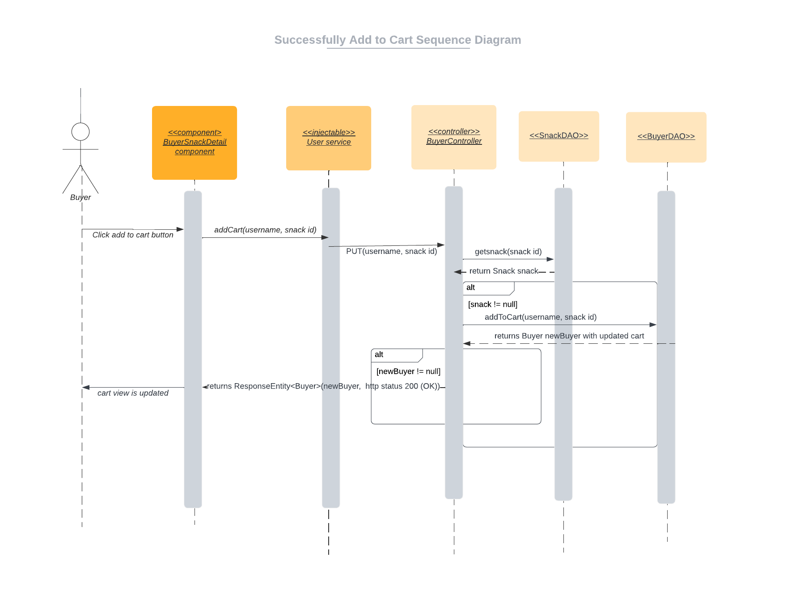
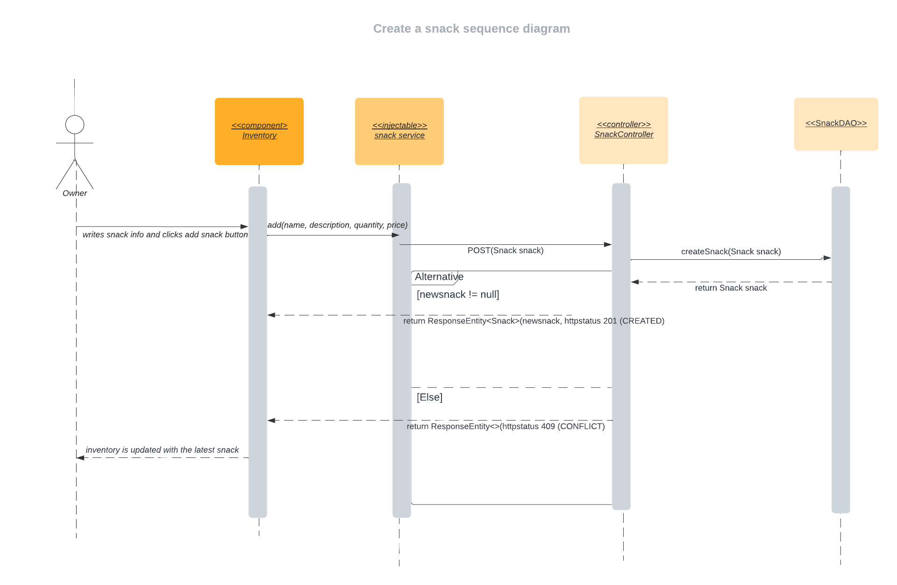

The main component that holds all the sub components together is the app component and it
holds the navigation bar along with all the features of the website together. It allows for a 
central domain for where all users, buyers, and owners can access the website and its features.

Within the app component is the homepage which is the first thing a user will see upon 
entering the website. It serves as a welcoming message to the user and it allows them to see a sample
of snacks in the inventory. Entices them to stay and see more about the website. 

The login componenet restricts certain actions and features from different users. Owners who log in as admin
are able to access inventory of the snacks, they can add, edit, and delete snacks, howvever they are
unable to view/access their shopping cart. 

  As a buyer with an acconut they are able to view their cart,
  add items to their cart, remove items, edit the quantity of items, and check out. They are unable to 
  edit information about the snacks. 

  As a user who does not have an account on the website they cannot 
  have access to any of these features, all they can do is browse the store. If they want to buy an item
  they can register an account and they are allowed to have access to a buyers features. 

  This switch is made due to multiple callings sent to the buyer controller from the login component.
  Once the user had entered their username, the login component will then go the auth-service file to 
  the user service file and then that would send an http request of GET along with the username to the
  buyer controller where it would process the request and send back info if the process was fullfilled
  and if the user is confirmed. If the process was fulfilled an http resposne would be status code OK (200),
  and the user would be directed to the appropriate page with limited features.

When a buyer wants to browse the snacks they are able to when they click on the catalog link.
They are given all the snacks in a list and they can search for a snack when they type a key word
and several snack options will appear. This is due to the Http Request of GET along with the the
name of the snack sent from the snack service file to the snack controller file. 

Once a buyer clicks on a snack to view they are routed to that snack details page. If they desire that snack they click 
add to cart and that calls the addToCart method from the snack-detail componenet to the user service file.
The user service file will send a Http request of PUT along with the username of the buyer, and the id of the snack to 
the BuyerController. The BuyerController file will process the demand in the Buyer and Snack DAO files and send
a response status of OK (200) and an updated buyer cart if successful. If the buyer feels they want to browse more they 
can click the go back button. 

By clicking the shopping cart link in the navigation bar buyers are sent to a separate page 
where they can view the items they added to their cart. Automatically the quantity of each item in the cart is 1 but this can be 
changed on the buyers discrection. 

  To increase or decrease the number of each snack in the cart, or even remove the item the buyer will click on either the + or 
  button and that will call either the addCart or deleteCart method from the shopping cart component to the user service file.
  The file will then send a http request of either PUT or DELETE along with the the buyers username and the snack's id to the 
  Buyer controller. If successfull a status code of OK (200) along with the updated buyer's shopping cart will be sent to the component.
  Buyers can buy as many snacks as they want however they cannot buy more than the snacks stock quantity. Based on how many
  snacks a buyer has in the cart the total cost will fluxuate, and so will the indivdual prices
  for each snack. Once a buyer is satisfied they can click checkout and a success purchase will
  be made.

When an admin is logged in they are limited to viewing only the inventory, homepage, and login.
In the iventory the admin side they are able to view all the snacks in the e-store. They can also search for 
specific snacks using a search bar. This process is similar to the buyers search however the snacks that appear
can be edited. They can edit all the information of a snack and save it. The updated information will be shown 
to current and future buyers once this change is made. Admins can also can add a new snack or delete an entire 
snack from the the website.

  By filling out all the information boxes in the add snack section and click add snack this will make the inventory
  component call the add method in the snack service file. The method will create a snack object and send a http request 
  of POST with that snack object to the SnackController. The snack controller will send a createSnack method
  to the SnackDAO file to update the JSON file that contains all the snacks in the store. A response entity will
  be sent back containing a status code of OK (200) and the new snack if successfull. The new snack will be sent to the inventory
  of the owner and to the buyers side.

  To delete a snack the admin can click on a button below the snack with an x mark and that will call the delete method
  in the inventory component. That will call the deleteSnack method in the user service which will send a Http request of DELETE
  followed by the id of the snack to the SnackController. The SnackController will then call the deleteSnack method, processes
  the request and then return a resposne entity of OK(200) to the front.

### ViewModel Tier
> _Provide a summary of this tier of your architecture. This
> section will follow the same instructions that are given for the View
> Tier above._

> _At appropriate places as part of this narrative provide one or more
> static models (UML class diagrams) with some details such as critical attributes and methods._

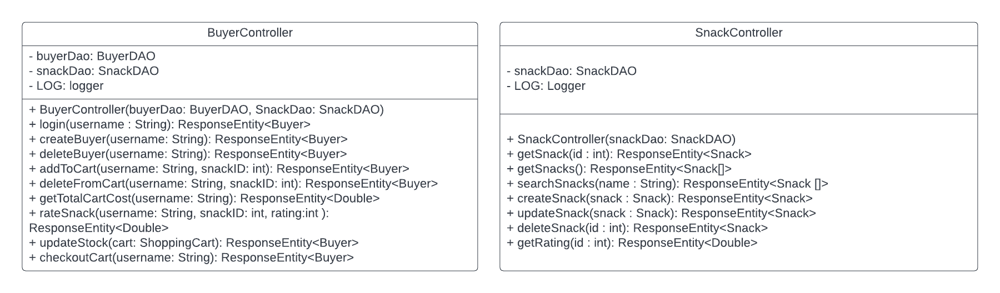

Buyer controller:

For all actions of a buyer this is where most of those actions are called. The buyer controller
is where each action of a buyer is sent to the server for the server to process and fufill. 
With each function call, it sends the information necessary for that action such as HTTP requests and returns
new information along with a http response declaring if that action was successful or not.

When registering an account the login component will call the register method in the auth-service service file
and then it calls the register method in the user service file. The register method in the user servive file
will send a Http request of POST along with the users new username. The http request will be sent to the 
BuyerController where the createBuyer method will be called. That method will go the BuyerDAO file and update 
the buyers in the JSON file. Once updated a response entity of type Buyers along with the status code of CREATED 
will be sent back to the controller. If theres already another user with that name then status code of CONFLICT will
be sent. If not either of those codes are sent then it will send INTERNAL_SERVER_ERROR.

For login its the same path as registering however instead of a Http request of POST it will send GET with the username. 
The responseEntity returned would be of type Buyer and would return 1 of 3 status codes of OK if found, NOT_FOUND, and 
INTERNAL_SERVER_ERROR.

For addToCart the buyer-snack-detail componenet will call the addCart method from the 
user service file which sends a http request of PUT along wth the username of the buyer and the snack id 
to the BuyerController. It will call the addToCart method which will add a snack from the SnackDAO file to 
the BuyerDAO file and returns a new buyer with an updated shopping cart along with status code OK

Delete from cart is similar as it follows the same path through files however it uses the deletefromcart
methods. Get total cart cost gives the total cart cost by calling getTotalCost in the user service, which sends
a http request of GET with the username to the BuyerController. That file processes it and returns a status
code of OK (200) if successful.

When the buyer is done browsing they can checkout which calls the checkout method in the user service and that sends
a http request of POST and with the buyers name to the BuyerController. It processes the request and returns
a status code of OK with the updated buyers cart.

Snack controller - 

Getting a snack will use the snack service file and which sends a http request of GET and depending
on if the id of a snack is given then it will locate the appropriate method in the SnackController. 
The Snack Controller will fulfill the request and return the snack with status code OK. Search snacks 
has a simiar path as getting a snack however it requires a string parameter and it returns an array
of snacks that fit the provided string.

Creating a snack requires a snack object to be made prior to this method being called. The snack object
is created in a typescript file of the inventory componenet and that calls the add snack method in the 
snack service file. The addSnack will send a http request of POST and the snack object to the Snack
Controller. The Snack Controller will then execute the createSnack() function and that adds a snack
object to the JSON file. When completed it will return that new snack to update the inventory and a 
status code of CREATED.

Update and delete snack have a similar path to the create snack method except that update snack requires
a snack object parameter while the deleteSnack requires a int parameter. Both returns a Response entity of
type Snack once completed.

### Model Tier
> _Provide a summary of this tier of your architecture. This
> section will follow the same instructions that are given for the View
> Tier above._

> _At appropriate places as part of this narrative provide one or more
> static models (UML class diagrams) with some details such as critical attributes and methods._

The model tier is where the main logic behind the store is. Its what defines the functionality 
of the store as a buyer, by defining methods to interact with snacks and their shopping cart.

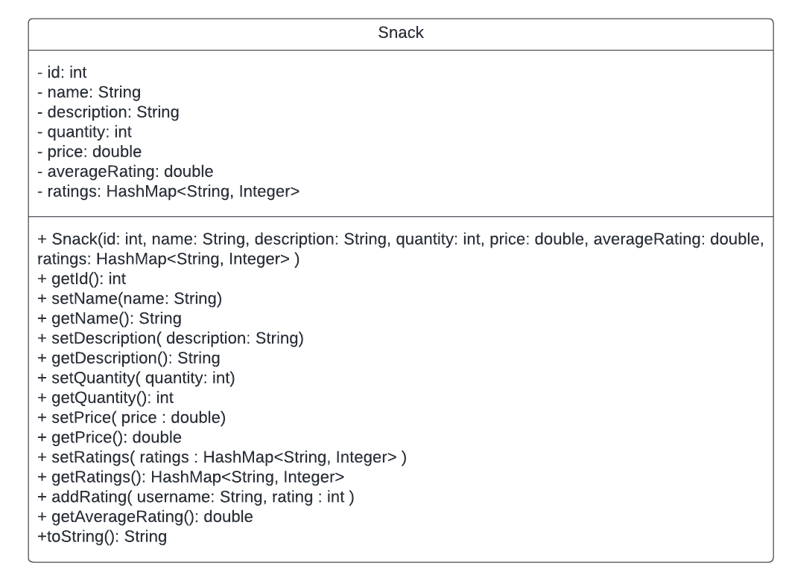

The main product our estore is selling are snacks. The snack model contains various private 
attributes to define a snack. Theres the id of a snack, the name, description, quantity, price,
averageRating, and a HashMap of ratings. We also have several methods under this model that aid 
in defining each attribute and obtaining each value. For ratings we have addRating that contains
2 parameters a string for the username of the buyer and a number for the actual rating. This method
created a rating and sets it in the Hashmap of ratings. The setRatings will set the average ratings
in the hashmap, and getAverageRating will return a double.

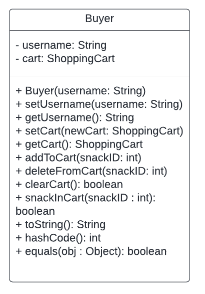

To set functionality and restricted features for only buyers of the website this model creates those actions.
The Buyer model contains 2 private attributes username as a string and a cart as a ShoppingCart object.
Within the class there are several defining and obtaining methods for each of these
attributes. There is setUsername, getUsername, setCart, and getCart. For setCart it requires for 
a shopping cart object to be made first before assigning it to a buyer. Once created and
assigned you can get the cart, add to the cart which requires a snack ID, and delete from the cart which also 
requries a snack ID. From these methods the buyer can see their cart and add and remove snacks from their
cart. Along with modifying the contents of a buyers cart they can checkout with the clearCart method. This
method provides the logic and functionality behind checking out a cart by removing all the contents in the 
cart. The snackInCart method is a helper function that determines if a specific snack is in the cart to 
reduce snack copies in the cart.

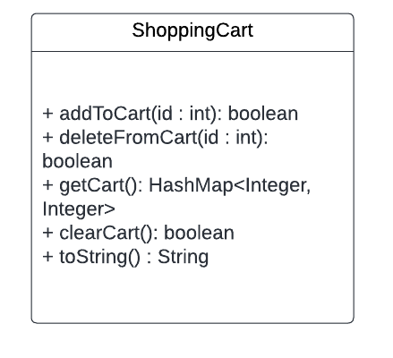

The Shopping cart itself is a hashmap, it contains the properties of a hashmap, therefore there
are no private attributes assigned. It has several methods that would help the buyer edit their cart 
and checkout. It has similar methods to the buyer class such as addToCart, deleteFromCart, getCart, 
and clearCart, however there are slight differences. The addToCart method returns a boolean, the 
getCart method returns a HashMap of the snack id and the quantity of the snacks. The clearCart method
checkouts the cart by removing the contents of the cart and returning a boolean to indicate if it was 
done successfully.

Persistence: 

The model classes provide a layout of methods to be used for the persistent files to use.
The persistence files use the methods in the models to update the JSON files, and to process
the requests sent from the controller. 

BUYERDAO - INTERFACE

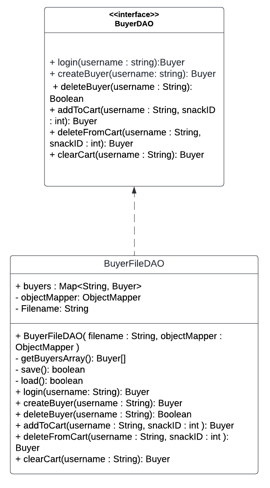

BuyerDAO is the interface to the BuyerFileDAO file. The interface consists of the main methods for a buyer such as login, createBuyer, deleteBuyer,
addToCart, deleteFromCart, and clearCart.

BUYERFILEDAO - IMPLEMENTS BUYERDAO

BuyerFileDAO is the file that implements the methods in the interface to buyer objects. It consists of 
creating a public buyers map thats of type String and Buyer and the other methods from the BuyerDAO file.
This file is the persistence tier of the overall estore architechture which means that this file is 
responsible for maintaining consistenty with any updates and changes sent from the front to the back. 
  
  For createBuyer once the buyer controller calls the createBuyer method in the BuyerDAO file, the BuyerFILEDAO
  file will process that method and save that information into the JSON object file. This updates the data in
  the server and makes it persistent to all users of the website. This logic is the same when it comes to the 
  other methods as well. 

  With a new buyer they can now add items to their cart by using the addToCart method. When the addtoCart method 
  is called in the buyerController it will call the addToCart method in the BuyerDAO which will then call the 
  addToCart method in the BuyerFileDAO. The addToCart function in the BuyerFileDao will check if the buyer exists 
  then it will add the snack to the buyers shopping cart, update the shoppingcart for the buyer, save that information
  in the JSON files and then send the buyer with their new shopping cart back to the controller.

  The buyer can checkout their cart with the clearCart method. The user servive file will send a http request of 
  POST along with the username of the buyer. That would then be processed by checkoutCart in Buyercontroller and that 
  would call clearcart in the BuyerFileDAO. ClearCart would clear the buyers shopping cart and save the updated
  shopping cart info to the JSON files. The buyer with their updated shopping cart would be sent back to the controller
  where it would then be sent back to the frontend to display the new information.

SNACKDAO - INTERFACE

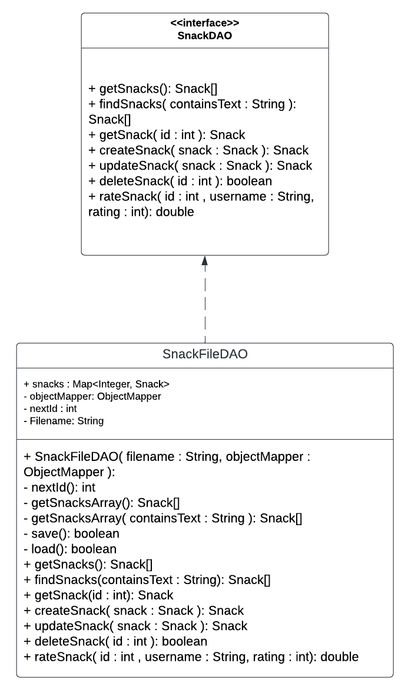

SnackDAO is the interface to the SnackFileDAO file. The interface consists of the main methods for a snack such as getSnacks, findSnacks, 
createSnack, uodateSnack, deleteSnack, and rateSnack.

SNACKFILEDAO - IMPLEMENTS SNACKDAO

SnackFileDAO implements the methods in the SnackDAO interface. It contains a map of snacks consisting
of type Integer and Snack along with many methods to get and update snacks. Methods include getSnacks, findSnacks,
createSnack, updateSnack, deleteSnack, and rateSnack

  If a user wanted to get a snack they use the getSnack methods. Depending on if the id of the snack was given 
  the user can find one specific snack or a list of snacks. The snack service file would send a http request of GET and 
  the id of the snack, if given, to the SnackController. The SnackController uses the getSnacks method in the SnackFileDAO
  and it retrieves that snack or a list of snacks from the JSON object file. The snacks will then be sent from the JSON file
  to the UI of the estore.

  When an admin wants to create a new snack they use the createSnack method. Snack service will send a http request of POST
  along with the new snack to the SnackController. The SnackController will call the createSnack method in the SnackFileDAO 
  which will create a new snack by getting the information from the snack passed in as a parameter. After a snack is created 
  it will be put in the Snack map and saved into the JSON file. The new snack will then be returned back to the UI to show 
  users the new snack in stock.

  If the admin decides to update a snack they use the update snack method. Snack service will send a http request of PUT
  along with the updated snack to the SnackController. The snacks information was already updated in the inventory typescript 
  componenet. The SnackController will call the updateSnack method in the SnackFileDAO which will update the snack by reassigning the
  new snack to the same snack id as before. This information will be saved in the Snack map and saved into the JSON file. 
  The new snack will then be returned back to the UI to show users the new snack in stock.

  If an admin wants to delete a snack, they can do so by using the delete snack method. Http request of DELETE along with the 
  id of the snack will be sent to the SnackController from the snack service file. It will then call deleteSnack from the SnackFileFAO
  and delete the snack from the JSON file. The deletion will be saved and persist for future user experiences.

### Static Code Analysis/Design Improvements

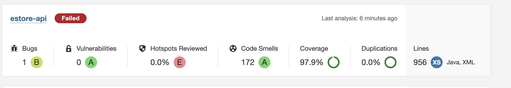
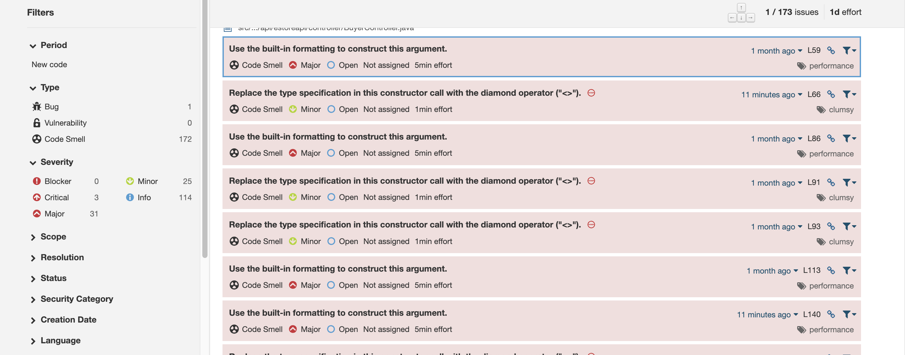
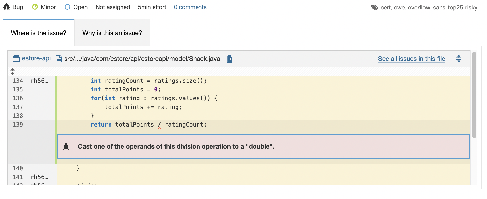
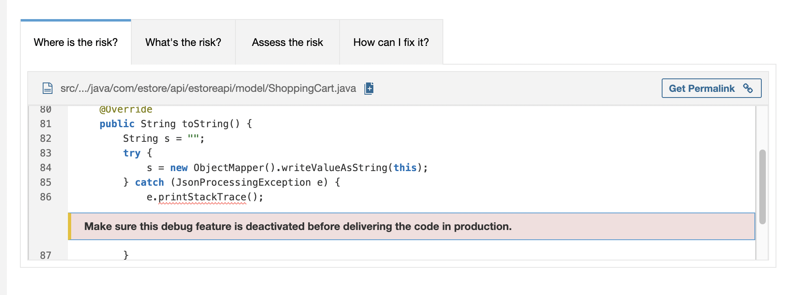

Based on the Code analysis from sonarqube we can say that we have to improve upon our hotspots and bugs.
The bug is a small issue in that there should be a blantant casting of one of the operands 
in the divison operation for the snack model file. The issue behind the security hotspot is 
that a debug feature should be deactivated before selivering the code in production. In addition
to these issues we also have many other major and minor issues in the code such as formatting
issues, cleaning up unwanted code, and cleaning up unnecessry code. 

Some improvements that can be made would be to cast one of the operands in the division operation
to a double to fix that bug. We can fix the security hotspot by removing the debug feature before
production. We can also reduce the amount of minor and major issues with reformatting, and cleaning
up code such as removing the keyword public when writing all the junit tests as its not necessary in this
version. 

  Some formatting issues can be to take out the object type in between <> for the ResponseEntities. 
  Its not necessary as java 7 compiler can infer the type. Commented out code should be removed and cleaned 
  out to improve readibility and reduce bloating. 
  
  Another issue to use a map instead of a hash map as a map can be hidden when its implemented but a hashmap 
  can be seen as its exposed as a public member and returned and accepted for public methods. 
  
  Other issues were to use the built in formatting to construct the parameters for the LOG.info within the 
  Controllers. It was suggested to not pass concatenated strings to the logging method as it would slow down 
  performance. We decided to not focus on fixing this issue as the performance of the website is still adequate.

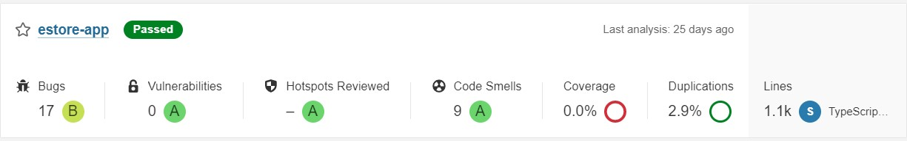
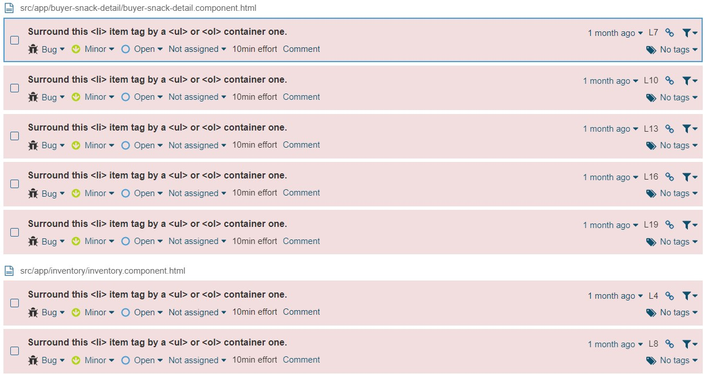
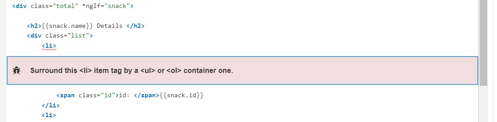

Based on the Code analysis from sonar scanner, we can say that we have to improve on our html pages. 
All of our bugs and smells are about surrounding our li tags with an ul or ol container tag. We did not focus 
on this bug because it does not change the overall display of our html pages. We can fix these bugs by 
surrounding our li html tags with the ul html tag. By doing this, we can achieve the zero bugs for the ui. 

For the future of the project we will be targeting these issues to improve upon our architecture, security, 
and readibiltiy. We will prioritize using code structures and practices that would ensure certain code will
be hidden such as using a map instead of a hash map where appropriate. We will use default formatting and 
modifiers such as not writing public in junit tests and not specifiying object type in <> of Response Entities.

Design improvements could consists of working on the frontend of the 10% feauture. We have not set up the Angular
portion of the 10% features and therefore users aren't able to see or interact with it. Besides this major design
improvement we can improve upon security and proper code techniques. We will consider using more secure code structures
to hide implementation such as maps. We could also improve upon the Angular side of the estore by cleaning up the
html and css of the website, in order to improve readibility and consistency of the website. 

## Testing
> _This section will provide information about the testing performed
> and the results of the testing._

### Acceptance Testing
Passed All Criteria: 27
Passed Some Criteria: 0
Passed No Criteria: 2
The main issue with acceptance criteria testing is that we haven't
completed the frontend of the 10% features for out product.
There is 0 passed com criteria because we split up the frontend
and backend parts of features and right now only the front end of
the 10% features havent been completed so there is 0 for some
criteria passed.
On the backend, a lot of our stories passed all the criteria.

### Unit Testing and Code Coverage
Our unit testing strategy is primarily in creating a fake database
of snacks and using that fake database to assert various functions
and conditional statements. The code coverage achieved from unit 
testing our snack files have shown to be above 90% covered.
The teams code coverage is finished with the mvp and 10% for the backend.

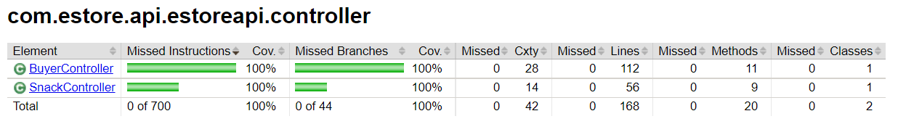
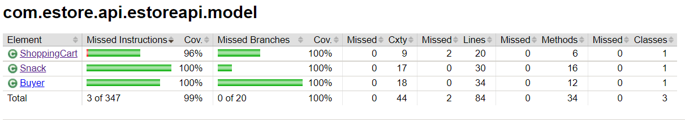
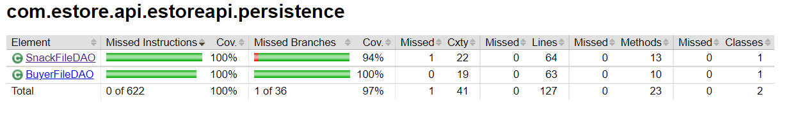

