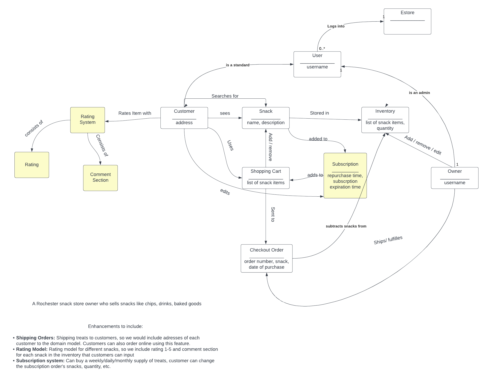

# PROJECT Design Documentation

> _The following template provides the headings for your Design
> Documentation.  As you edit each section make sure you remove these
> commentary 'blockquotes'; the lines that start with a > character
> and appear in the generated PDF in italics._

## Team Information
* Team name: Better Monkeys
* Team members
  * Lucie Lim
  * Dara Prak
  * Jaden Seaton
  * Robert Huang
  * Adam Pang

## Executive Summary

A snack e-store where users can browse, purchase, and rate snacks. 
If users love certain snacks they can set up a subscription that 
can automatically buy snacks at a weekly, monthly, or annual 
period.

### Purpose
The purpose behind the project is to learn about the development 
process of a website from scratch. In this case we learned the 
basics for a e-store website with functions for the owner and 
customers, such as adding new products, changing info of the 
product, browsing products, and updating customers shopping 
cart.

### Glossary and Acronyms
> _Provide a table of terms and acronyms._

| Term | Definition |
|------|------------|
| SPA | Single Page |

## Requirements

This section describes the features of the application.

User authentication: Depending on username and password the 
user will have certain responsibilities, and features they 
are able to access. The owner will be able to add, remove 
and change info of a product. Customers will see their 
subscription, reviews, and browse snacks.

Shopping cart: Users will be able to add and remove 
stuff from their cart, and update it to their satisfaction.

Rating System: Users will be able to create a review 
of a snack that would show others how good a snack is 
worth buying. They are able to see the average rating 
of a snack along with individual ratings of others. 

Subscription: Users who are frequent buyers can sign 
up for a subscription that will be able to repurchase
snacks in a weekly, monthly, or annual period. They 
can update the snacks they want to purchase or just
cancel their membership.

### Definition of MVP
A system where a user can make a snack, search for a 
specific snack, search for snacks given a word of the
snack, delete a snack, get all snacks, and update 
details of a snack.

### MVP Features
- Delete a single snack
- Update a single snack
- Create a new snack
- Get entire inventory
- Search for a snack
- Get a single snack

### Roadmap of Enhancements
- Subscription
- Ratings & reviews for snacks

## Application Domain

This section describes the application domain.

This is a domain model of our snack e-store, it shows the relations
between the user, and the features of our website such as the 
shopping cart, where the customer can add and remove items from 
the cart. The model also displays the relationship between the 
owner and the inventory, adding, removing, and updating snacks.
Also it shows new features such as the subscription where the
customer can edit a subscription and change how frequently 
they can recieve snacks.

## Architecture and Design

This section describes the application architecture.

### Summary

The following Tiers/Layers model shows a high-level view of the webapp's architecture.

The e-store web application, is built using the Model–View–ViewModel (MVVM) architecture pattern. 

The Model stores the application data objects including any functionality to provide persistance. 

The View is the client-side SPA built with Angular utilizing HTML, CSS and TypeScript. The ViewModel provides RESTful APIs to the client (View) as well as any logic required to manipulate the data objects from the Model.

Both the ViewModel and Model are built using Java and Spring Framework. Details of the components within these tiers are supplied below.

### Overview of User Interface

This section describes the web interface flow; this is how the user views and interacts
with the e-store application.

When a user first encounters our website they are presented with 3 buttons: 
inventory, catalog, and login. When they click on inventory they have access
to the owners actions such as updating a snack, adding a new snack, and 
even deleting it. When they choose the catalog they are presented with 
snacks, they can search but cannot update them, and they can add items 
to their shopping cart. When they click login they are given 3 fields 
where they can login as the owner, a customer, or register for the website.

### View Tier
> _Provide a summary of the View Tier UI of your architecture.
> Describe the types of components in the tier and describe their
> responsibilities.  This should be a narrative description, i.e. it has
> a flow or "story line" that the reader can follow._

> _You must also provide sequence diagrams as is relevant to a particular aspects 
> of the design that you are describing.  For example, in e-store you might create a 
> sequence diagram of a customer searching for an item and adding to their cart. 
> Be sure to include an relevant HTTP reuqests from the client-side to the server-side 
> to help illustrate the end-to-end flow._

### ViewModel Tier
> _Provide a summary of this tier of your architecture. This
> section will follow the same instructions that are given for the View
> Tier above._

> _At appropriate places as part of this narrative provide one or more
> static models (UML class diagrams) with some details such as critical attributes and methods._

### Model Tier
> _Provide a summary of this tier of your architecture. This
> section will follow the same instructions that are given for the View
> Tier above._

> _At appropriate places as part of this narrative provide one or more
> static models (UML class diagrams) with some details such as critical attributes and methods._

### Static Code Analysis/Design Improvements
Our Buyer implementation files have not been covered yet, and should the project continue, 
it would be in our best interest to focus on the buyer files and testing each individual
function. Testing these functions would allow us to continue developing the shopping
cart files and implement an organized method for handling our data persistence for 
buyers. 
Design improvements would lie primarily in the shopping cart files, as our code
analysis shows that we have malfunctioning methods that need to be revised. 
  - We can focus on improving our shopping cart by implementing simpler
  data structures and elaborating in the future into a more abstract class.

> _With the results from the Static Code Analysis exercise, 
> discuss the resulting issues/metrics measurements along with your analysis
> and recommendations for further improvements. Where relevant, include 
> screenshots from the tool and/or corresponding source code that was flagged._

## Testing
> _This section will provide information about the testing performed
> and the results of the testing._

### Acceptance Testing
Passed All Criteria: 11
Passed Some Criteria: 5
Passed No Criteria: 17
The main issue with acceptance criteria testing is that most 
of our stories for Sprint 2 have yet to be implemented or need
to be improved on. 
The UI stories primarily build up the composition of the "Passed
Some Criteria" category, since we found that some buttons need
to be revised for user/admin comparison.
On the backend, a lot of our stories passed no criteria since they
have failed to work or need to be improved on.

### Unit Testing and Code Coverage
Our unit testing strategy is primarily in creating a fake database
of snacks and using that fake database to assert various functions
and conditional statements. The code coverage achieved from unit 
testing our snack files have shown to be above 90% covered, where
the final 10% lie in additional functions yet to be covered and will
be our primary focus for code coverage. 
The team's coverage target is now in finishing the final 10% of snack
files and then shifting over to the buyer files as we implement
the shopping cart. 
Currently, our code coverage meets our targets well, and we want to 
continue this for our shopping cart, buyer login, and 10% feature 
implementations.
